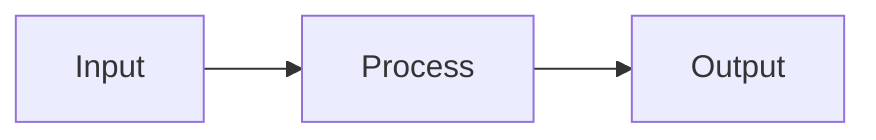

# Badges and Visual Elements

Reference material for badge implementation, visual elements, and social proof.

## Priority Badge for Virality

The star badge is the highest-impact social proof badge. Include if stars > 100:

```markdown
[](https://github.com/user/repo)
```

## Badge Implementation

```markdown
[](link)
[](link)
[](link)
[](link)
[](link)
[](link)
```

**Rules:**
- Use shields.io for all badges (consistent styling)
- Pick one style (flat, flat-square, for-the-badge) and use it consistently
- For CLI tools, include a Repology badge showing packaging status

## Impressive Metrics Badges

Only include metrics that are impressive. Thresholds:

| Metric | Include If | Badge |
|--------|------------|-------|
| Stars | > 100 | `` |
| Downloads | > 1000/week | `` |
| Contributors | > 10 | `` |
| Forks | > 50 | `` |
| Last commit | < 30 days | `` |

**Rule:** If a metric isn't impressive, don't include it. A badge showing "2 stars" hurts more than it helps.

## Dark/Light Mode Support

For theme-aware logos, use the `<picture>` element:

```html
<picture>
  <source media="(prefers-color-scheme: dark)" srcset="logo-dark.png">
  <source media="(prefers-color-scheme: light)" srcset="logo-light.png">
  
</picture>
```

## Visual Elements

### GIF Demos (Mandatory for CLI Tools)

Terminal recordings are mandatory for CLI tools. Use:
- **vhs** - scripted terminal GIFs (recommended)
- **terminalizer** - interactive recording
- **asciinema** - terminal session sharing

**GIF Requirements:**
- Under 10MB (GitHub limit)
- 10-15fps is sufficient
- Show the "aha moment" - core value in action
- Drag-drop into README editor to host on GitHub's CDN

### Screenshots

For UI-heavy projects:
- Include both light and dark mode versions
- Compress before adding (ImageOptim, XConvert)
- Use descriptive alt text

### Tables

Use tables for:
- Feature comparisons
- API parameters
- Benchmark results
- Installation matrices (cross-platform)

### Architecture Diagrams

For complex projects, use Mermaid (GitHub-native):

```markdown

```

## Social Proof

### "Used By" Section

Place prominently after hero section with 6-12 company logos:

```markdown
## Used By

<p align="center">
  
  &nbsp;&nbsp;&nbsp;
  
</p>
```

### Star CTA

Engaging call-to-action patterns:
- `⭐ Star if this saved you hours of debugging!`
- `🌟 If this helped, a star would make our day!`

**Rules**: One CTA max. Humor optional but never cringe.

### Testimonial Formatting

Format endorsements for maximum impact:

```markdown
> "This tool is incredible. Saved us 10 hours/week."
> — [@notable_person](https://twitter.com/notable_person), CTO at Company

> "The best debugging tool I've used in years."
> — [@developer](https://github.com/developer), Maintainer of PopularProject
```

**Rules:**
- Include real link to person's profile
- Include role and company/project for authority
- Quote must be permission-granted or public (from tweet, blog post, etc.)
- Prioritize: industry leaders > popular project maintainers > power users

### Community Links

```markdown
[](link)
[](link)
```

### Supporting Files

These files signal project maturity:
- CONTRIBUTING.md
- CODE_OF_CONDUCT.md
- SECURITY.md
- LICENSE
